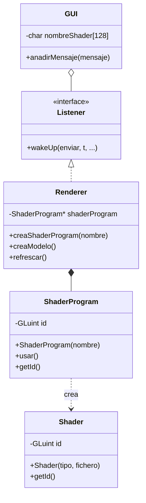

# Solución al problema de reflexión

---

Según la [documentación de glfw](https://www.glfw.org/docs/3.3/window_guide.html), cada ventana tiene un puntero asociado (por defecto `NULL`) que puede modificarse mediante los metodos `glfwSetWindowUserPointer` y se puede recuperar con `glfwGetWindowUserPointer`

De esta manera, cuando se inicializa la ventana, podemos asignarle un objeto PAG::Renderer, y luego dentro del callback `window_refresh`, se puede recuperar con el `get` y podemos llamar a la función `refrescarVentana()`

## Cambios en la práctica 2
He creado una clase Renderer que gestiona todo el rendering de la aplicacion, utilizando el patrón singleton, para que solo pueda haber una instancia durante toda la aplicación
Se ha creado una clase GUI que gestiona las interfaces como la de selección de color (usando ImGui), esta tambien sigue el patrón singleton

También se ha creado una interfaz Listener para implementar el patrón observador, que se usa en Renderer para que la clase GUI avise cuando se cambia el color.

## Cambios en la práctica 3
Se han añadido atributos a Renderer para poder gestionar shaders, que se cargan a traves de ficheros externos.
Los shaders dibujan un triángulo, en el que cada uno de los vertices usa un color distinto (un solo VBO entrelazado, aunque también está la no entrelazada)

Al redimensionar la ventana el triángulo también se redimensiona el triángulo por que los vertices se dibujan respecto al viewport. Al cambiar el tamaño de la ventana se llama a `PAG::Renderer::getInstancia().cambiarTamano(width, height);` que cambia el viewport, haciendo que los vertices se dibujen respecto al viewport nuevo.

## Cambios en la práctica 4

He creado dos clases nuevas para desacoplar los shaders: `Shader` y `ShaderProgram`, la idea es que
renderer tiene un puntero de `ShaderProgram`, y cuando se construye con el nombre, crea los vertex y fragment shaders.

La GUI tiene una ventana en el que se le pasa el nombre del shader, al darle al boton carga los shaders.

## Cambios en la práctica 5
Para controlar la cámara de manera encapsulada, he creado la clase Camara, que guarda todos los atributos y metodos necesarios para operarla.
El renderer guarda un atributo de tipo camara para que el renderer lo pueda operar.
Se ha creado en la GUI una ventana de ImGui para controlar la camara como se pide. También se puede controlar con el ratón, guardando información de la posición del ratón cuando se está haciendo click, el movimiento depende del tipo de movimiento que esté seleccionado en la GUI.

Para poder usar la aplicación, simplemente se ejecuta, se carga el nombre del shader (../pag05) y debería aparecer el triangulo. Para interactuar con la cámara se hace mediante la ventana de ImGui.